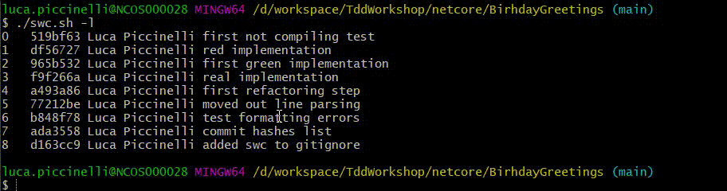

# switch_commit

Bash script to switch between git commits

## Usage example

```bash
./swh.sh 0 #detaches to the first commit
```

```bash
./swh.sh -l main #list all the commits of the given branch, with commit number
```



## Warning

It creates a file named **git_ids.txt**. Be careful to put it in your **.gitignore**.
